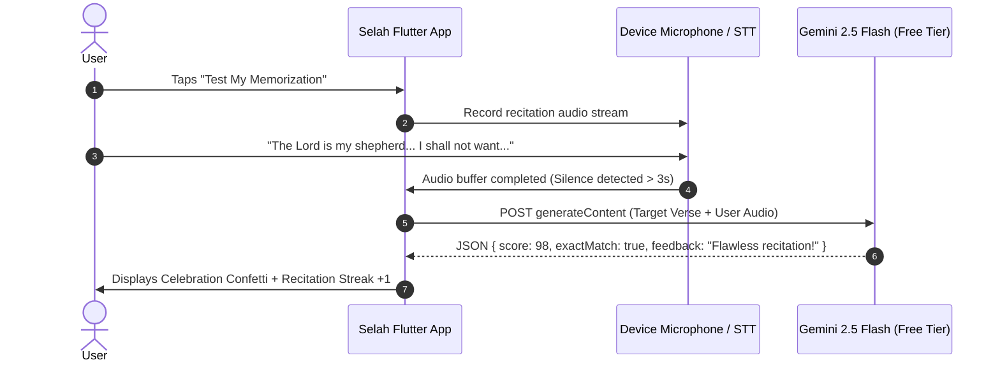

# Gemini AI Free Tier: Voice Scripture Memorization & Recitation Verification Feature

Specification for using Google Gemini's free tier (Gemini 2.5 Flash / 2.0 Flash) to listen to users recite scripture verses from memory, accommodate natural breath pauses, and provide encouraging, accurate recitation feedback.

---

## 1. Feature Vision

Scripture memorization is most effective when spoken aloud. This feature introduces an interactive recitation partner:
1. **Target Verse Prompt**: User chooses a verse to memorize (e.g. Philippians 4:6-7 or Psalm 23:1).
2. **Listen Mode**:
   - Continuous audio streaming or audio buffer recording with Smart Pause Detection (ignores brief 1-3s contemplative pauses while user thinks of the next word).
3. **AI Comparison & Encouragement**:
   - Transcribes user speech and compares it word-for-word against the canonical translation.
   - Highlights accurately recited phrases in green, omitted words in yellow, and substituted words in purple.
   - Provides gentle audio or visual hints when the user hesitates.

---

## 2. Gemini Free Tier Capabilities & Architecture

Google Gemini Developer API provides a free tier for **Gemini 2.5 Flash** and **Gemini 2.0 Flash**:
- **Rate Limit**: Up to 15 Requests Per Minute (RPM) and 1,000,000 Tokens Per Minute (TPM) on the free tier.
- **Multimodal Audio Input**: Accepts raw audio bytes (PCM, WAV, MP3) directly in `generateContent` or real-time streaming via the Gemini Live WebSocket API.



---

## 3. Gemini System Prompt & Structured Output

### Prompt Template:
```text
You are an encouraging, precise Scripture Memorization Coach.
The user is reciting from memory:
Translation: {translation} (e.g. BSB)
Target Reference: {reference}
Target Text: "{canonicalText}"

Analyze the user's spoken audio or transcript.
Return ONLY valid JSON matching this schema:
{
  "accuracyPercentage": 95,
  "verbatimMatch": false,
  "recitedText": "The Lord is my shepherd, I will not want",
  "discrepancies": [
    {
      "expected": "shall not want",
      "spoken": "will not want",
      "type": "substitution"
    }
  ],
  "encouragement": "Wonderful work! You captured the full meaning with only one minor word variation."
}
```

---

## 4. Implementation Stages

| Stage | Scope | Key Package |
| :--- | :--- | :--- |
| **Phase 1 (v0.3.5)** | In-App Speech-to-Text (`speech_to_text`) + Text Comparison | `speech_to_text`, `google_generative_ai` |
| **Phase 2 (v0.4)** | Raw Multimodal Audio Sent Directly to Gemini 2.5 Flash for inflection & accent resilience | `record`, `dio` |
| **Phase 3 (v0.4.5)** | Real-Time Live Bidirectional Streaming with Gemini Live WebSockets | `web_socket_channel` |
