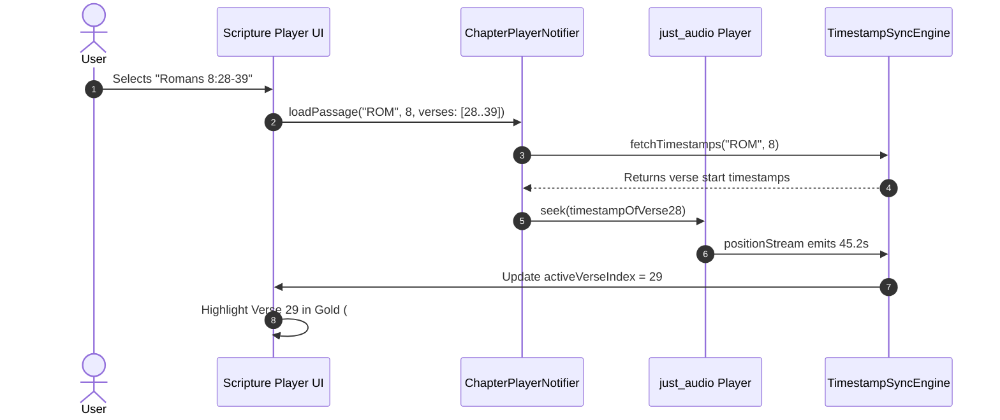

# v0.3 Roadmap: Timestamps, Verses, and Passage Synchronization

## Overview
While **v0.2** establishes robust complete chapter streaming via API.Bible and peaceful TTS for Old Testament WEB and single verses, **v0.3** will introduce millisecond-accurate verse and passage synchronization ("Karaoke" audio highlighting).

---

## 1. Data Sources for Audio Timestamps

### Source A: Faith Comes By Hearing (FCBH) Bible Brain API
- **Endpoint**: `GET https://4.dbt.io/api/timestamps/{fileset_id}/{book_id}/{chapter}?v=4&key={FCBH_API_KEY}`
- **Payload Schema**:
```json
[
  {"verse_start": "1", "timestamp": 0.00},
  {"verse_start": "2", "timestamp": 4.82},
  {"verse_start": "3", "timestamp": 12.35},
  {"verse_start": "4", "timestamp": 18.91}
]
```
- **Languages**: 1,400+ languages with dramatized and non-dramatized audio recordings.
- **Verse-Level Seeking**: Allows users to tap verse 3 and instantly jump the audio player to `12.35s`.

### Source B: API.Bible Verse & Passage Endpoints
- **Audio Bible Chapter Audio**: `/v1/audio-bibles/{audioBibleId}/chapters/{chapterId}`
- **Text Passages Endpoint**: `/v1/bibles/{bibleId}/passages/{passageId}`
- **Verses Breakdown**: `/v1/bibles/{bibleId}/chapters/{chapterId}/verses`

---

## 2. Audio + Timestamp Sync Architecture (v0.3)



---

## 3. Planned Flutter Implementation

1. **Model**:
```dart
class VerseTimestamp {
  final int verseNumber;
  final Duration startPosition;
  final Duration endPosition;

  VerseTimestamp({
    required this.verseNumber,
    required this.startPosition,
    required this.endPosition,
  });
}
```

2. **Player Stream Listener**:
```dart
_audioPlayer.positionStream.listen((currentPos) {
  final currentVerse = timestamps.lastWhere(
    (t) => currentPos >= t.startPosition,
    orElse: () => timestamps.first,
  );
  if (state.activeVerseNumber != currentVerse.verseNumber) {
    state = state.copyWith(activeVerseNumber: currentVerse.verseNumber);
  }
});
```

3. **Passage Range Looping**:
- If user chooses a passage range (e.g. `Romans 8:31-39`), the player automatically seeks back to verse 31 upon reaching the end timestamp of verse 39, enabling infinite meditation loops on customized passages!
